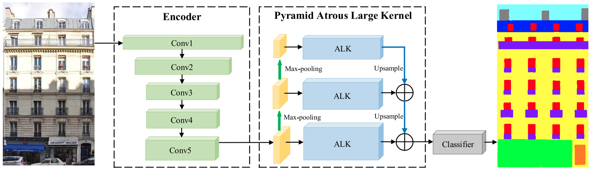

# Pyramid ALKNet for Semantic Parsing of Building Facade Image
This project contains the Tensorflow implementation for the proposed Pyramid ALKNet: [[IEEE Xplore]](https://ieeexplore.ieee.org/document/9097171).

### Introduction
The semantic parsing of building facade images is a fundamental yet challenging task in urban scene understanding. Existing works sought to tackle this task by using facade grammars or convolutional neural networks (CNNs). The former can hardly generate parsing results coherent with real images while the latter often fails to capture relationships among facade elements. In this letter, we propose a pyramid atrous large kernel (ALK) network (ALKNet) for the semantic segmentation of facade images. The pyramid ALKNet captures long-range dependencies among building elements by using ALK modules in multiscale feature maps. It makes full use of the regular structures of facades to aggregate useful nonlocal context information and thereby is capable of dealing with challenging image regions caused by occlusions, ambiguities, and so on. Experiments on both rectified and unrectified facade data sets show that ALKNet has better performances than those of state-of-the-art methods.
<p align="center"></p>

### Installation
- Env: Python 3.6; TensorFlow 0.5-1.5; CUDA 9.0; cuDNN
- Install some packages
```
pip install opencv-python pillow numpy matplotlib imageio .....
```
- Clone this repository
```
git clone https://github.com/wohaiyo/Pyramid_ALKNet
cd Pyramid_ALKNet
```
- One GPU with 11GB is needed

### Dataset
You need to download the two dataset——ECP and RueMonge2014, and put the files in the `data` folder with following structure.
```
├── ecp
|    |── ecp1
|    |   ├── train
|    |   |   ├── img
|    |   |   └── label
|    |   ├── val
|    |   |   ├── img
|    |   |   └── label
|    |   ├── train.txt
|    |   └── val.txt
|    |── ecp2
|    |   ├── train
|    |   |   ├── img
|    |   |   └── label
|    |   ├── val
|    |   |   ├── img
|    |   |   └── label
|    |   ├── train.txt
|    |   └── val.txt
|    |── ecp3
|    |   ├── train
|    |   |   ├── img
|    |   |   └── label
|    |   ├── val
|    |   |   ├── img
|    |   |   └── label
|    |   ├── train.txt
|    |   └── val.txt
|    |── ecp4
|    |   ├── train
|    |   |   ├── img
|    |   |   └── label
|    |   ├── val
|    |   |   ├── img
|    |   |   └── label
|    |   ├── train.txt
|    |   └── val.txt
|    |── ecp5
|    |   ├── train
|    |   |   ├── img
|    |   |   └── label
|    |   ├── val
|    |   |   ├── img
|    |   |   └── label
|    |   ├── train.txt
|    |   └── val.txt
├── RueMonge2014
|    ├── train
|    |    ├── img
|    |    └── label
|    ├── val
|    |    ├── img
|    |    └── label
|    ├── train.txt
|    └── val.txt           
```

### Training

- You can run: `python train.py -h` to check the detail of optional arguments.
Basically, in the `config.py`, you can set the dataset, train type, epochs and batch size, etc.
```
python train.py
```
- training on Cityscapes train set


### Testing
- After training, the checkpoint will be saved at `saves` folder, you can use `eval.py` to get the result.
```
python eval.py
```

### Citation

Please consider citing the [Pyramid ALKNet](https://ieeexplore.ieee.org/document/9097171) if it's helpful for your research.
```
@article{ma2020pyramid,
  title={Pyramid ALKNet for Semantic Parsing of Building Facade Image},
  author={Ma, Wenguang and Ma, Wei and Xu, Shibiao and Zha, Hongbin},
  booktitle={IEEE Geoscience and Remote Sensing Letters},
  year={2020},
  publisher={IEEE}
}